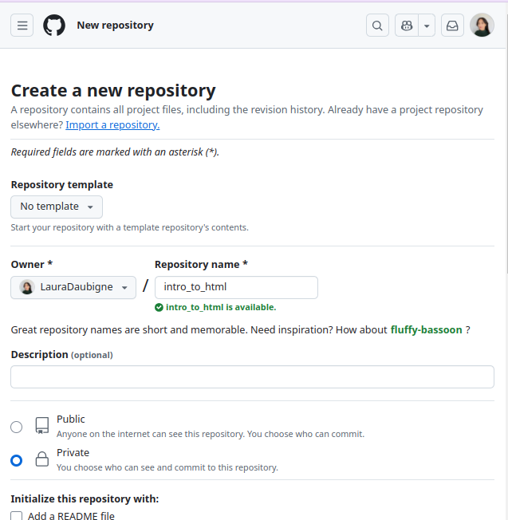
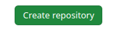
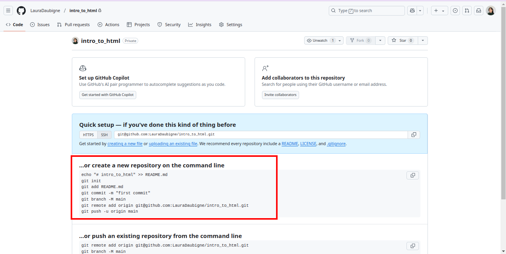

# HTML Basics Exercises  
## Objectives and Tasks  

### 0. **Preparation of the project structure**  


**Create the directory and file**  

Open the terminal, run:
>  `cd`  
>  `mkdir -p practices/html/intro_to_html`  
>  `cd practices/html/intro_to_html`  
>  `touch index.html`  
>  `code index.html`  

**⚠️ if `code index.html` command does't recognize the `code` command:**  
install it by following the video below, and re-run this command.  


Now, once VS Code has opened the folder intro_to_html, open the file index.html, copy/paste the code below, and save.  
```html
<html>
    <head>

    </head>
    <body>
        <!--code here -->
    </body>
</html>
```


### 1. **Basic Structure of an HTML Document**  
**Objective:** Understand the basic structure of an HTML document.  
**Task:**  
- Create a simple HTML file with the following elements:  
  - The correct `<!DOCTYPE html>` declaration.  
  - `<html>`, `<head>`, and `<body>` tags.  
  - Inside the `<head>` tag, include a `<title>` tag with a title for the webpage.  

---

### 2. **Creating Headings**  
**Objective:** Learn how to use heading tags.  
**Task:**  
- Create an HTML file with headings of different levels (`<h1>` to `<h6>`).  
- Each heading should describe its level, e.g., "This is a level 1 heading".  

---

### 3. **Paragraphs and Text Formatting**  
**Objective:** Introduce paragraphs and basic text formatting.  
**Task:**  
- Write a short paragraph about a favorite hobby using the `<p>` tag.  
- Within the paragraph:  
  - Use `<strong>` or `<b>` to bold some text.  
  - Use `<em>` or `<i>` to italicize other text.  

---

### 4. **Creating Links**  
**Objective:** Learn how to create hyperlinks.  
**Task:**  
- Add a hyperlink to the HTML file using the `<a>` tag.  
- The link should:  
  - Point to a favorite website.  
  - Open in a new tab (use the `target="_blank"` attribute).  

---

### 5. **Adding Images**  
**Objective:** Understand how to add images to a webpage.  
**Task:**  
- Insert an image using the `` tag.  
- Use an image URL from the web.  
- Include `alt` text to describe the image.  

---

### 6. **Unordered and Ordered Lists**  
**Objective:** Learn how to create lists.  
**Task:**  
- Create an unordered list (`<ul>`) of your favorite fruits.  
- Create an ordered list (`<ol>`) of your top 3 movies.  

---

### 7. **Creating a Simple Webpage**  
**Objective:** Combine multiple HTML elements to create a simple webpage.  
**Task:**  
- Create a basic webpage that includes:  
  - A heading.  
  - A paragraph.  
  - An image.  
  - A link.  
  - Both an unordered and ordered list.  

---

### 8. **HTML Comments**  
**Objective:** Learn how to use comments in HTML.  
**Task:**  
- Add comments throughout the HTML document to explain what each section of the code does.  

### 9. **Publishing - (GIT Versionning 1/2)**  


- ***Create the github repo***


- click the button to get the first publication instructions


- and you will be redirected to the following page

:warning Keep that page opened, later you will execute the command lines in the red rectangle

- ***Push your work in your repository***

Open your terminal in vs code, and run:

1. *Make sure you are in work project directory*
`cd`
`cd practices/html/intro_to_html`
2. *Follow and run your repository's instructions*
You need to run every command lines in the red rectangle of the page you kept opened.

- **⚠️ toolbox and tips**
- - if you encounter an issue and want to reset from the begining, run:
`rm -rf .git`


### 10. **Merge - (GIT Versionnig 2/2)**  

Now you will make a new version of index.html on a new branch, by adding a comment.

- ***Create a new branch***

Open your terminal in vs code, and run:

1. *Make sure you are in work project directory*
`cd`
`cd practices/html/intro_to_html`
2. *Create new branch from main*
`git checkout main`
`git checkout -b newBranch`
3. *Edit your index.html by adding a comment*
4. *Commit your change in the new branch*
`git add index.html`
`git commit -m "add comment"`
5. *Merge your comment into your main branch
`git checkout main`
`git merge newBranch`
6. *Push the comment from main*
`git push`


---

### Notes:  
These exercises are designed to provide a solid introduction to HTML basics. By completing them, you’ll gain confidence and a foundation in web development.  
